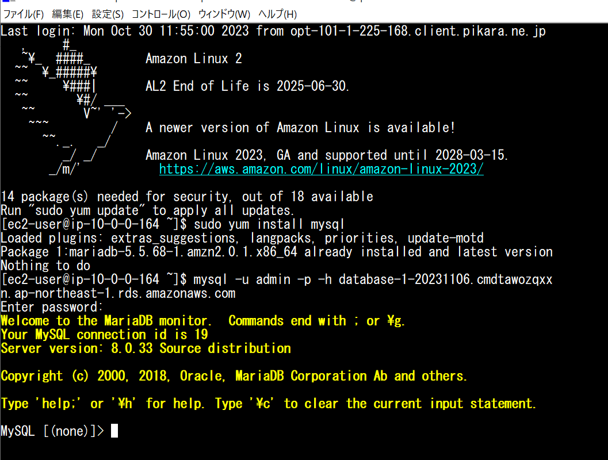
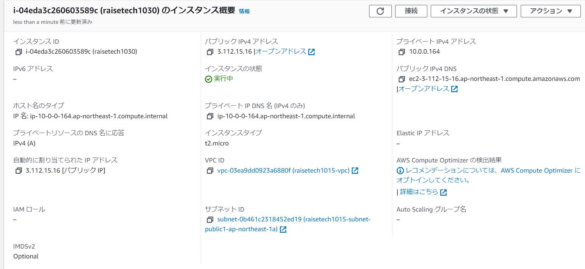
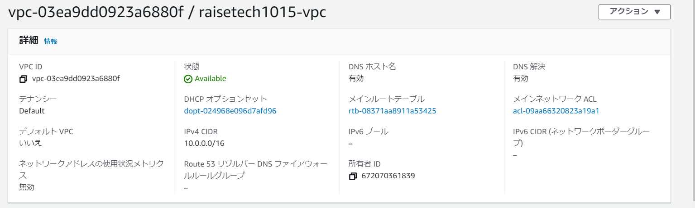

#第4回課題（２回目） 

1.VPCの作成 
　一度VPCを削除 
　マニュアルを参考にしながらVPCを作成 
 
2.EC2の作成 
　VPCからEC2の作成まで移動する 
　その際、パブリックIPの自動割り当てを確認 
 
3.RDSの作成 
　EC2からRDSの作成まで移動する 
　RDSを作成して、EC2に接続する 
 
4.接続の確認(重要) 
　ローカルからSSH接続を行う（Tera term） 
　アドレス？を打ち込み、鍵を入力して入る 
　最初はMysqlが入っていないので、ダウンロードする 
　（Mysqlのバージョンに注意）（RDSの作成時に注意する） 
　RDSのアドレスを打ち込み、パスワードを入力して接続完了 
 
※画像のアップロードについて 
git add (画像.PNG) 
git commit -m "コメント" 
git push origin (ブランチ名) 
※ファイルのところは.PNGにする　.pngではだめ！ 
 
 
 
 
