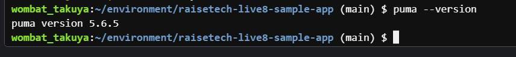

#第3回課題について

1.最低限の作業について
　-AWS
　-git clone
  -MySQLのインストール
  -Gemのインストール
  -rails s 起動
  -ブラウザの接続確認（fruit）が登録できるか

2.APサーバーについて
　-Puma　バージョン確認（画像参照）
  "puma --version"    puma version 5.6.5
  "cd raisetech-live8-sample-app"で対象フォルダに移動する！！
  pumaの起動
  "rails s"
  pumaの終了
  "Ctrl + c"
  繰り返す！
  APサーバー（Puma）を終了させた後、再びサーバーを起動することはできる

AP サーバーを終了させた場合、引き続きアクセスできますか？結果を確認して、また AP サー
バーを起動してください。
APサーバー終了・停止させた場合は、ウェブアプリケーションにアクセスはできません。
サーバーを起動することはできました。

3.DBサーバーについて
　-MySQLの起動
　-バージョン確認（画像参照）
"sudo cat /var/log/mysqld.log | grep "temporary password" | awk '{print $13}'"
"mysql -u root -p"
パスワードを打ち込む（打ち込んでも見えない）
"quit"で終了
"mysql -u root -p"
パスワードで再びMySQLへ

DB サーバーを終了させた場合、引き続きアクセスできますか？
DBサーバーを終了させたあと、ウェブアプリケーションにアクセスできません。

まとめ
APサーバー・DBサーバー両方が起動していないとウェブアプリケーションにはアクセスできない。

4.Railsの構成管理ツールの名前
　-Gem
　①パッケージ
　②パッケージ管理ツール
  構成管理としてBundlerと呼ばれるツールを使う。
  "bundle install"を用いる

5.今回の課題から学んだこと
　課題から学んだことは２点あります。1点目は、Railsを使ってアプリケーションを作動
させることの難しさです。似たような環境でも、少しの違いで動かなくなってしまうので
、違いを見つけるのが難しかったです。一方、違いを見つけて動くようになったときは非
常に達成感を得ることができたのでよかったです。2点目に、Githubについてです。前回>の課題でGithubを使ってPRをしましたが、繰り返し使うことで、やり方にも慣れるととも
に、なぜできないのかが少しずつ分かるようになってきました。まだまだ慣れていないと
ころもあり、このような場合にはできるけど、このような場合にはできないまた、そので
きない理由を見つけていきたいです。

